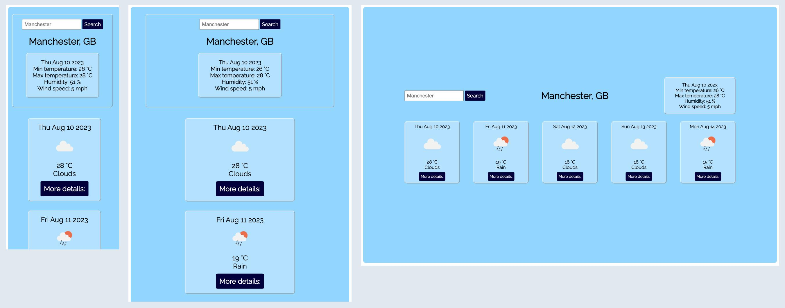

# Weather App

 

- I built this app using React, JavaScript and CSS as a project for Command Shift bootcamp. 
- It was created using the npx script `create-react-app`. 
- I wrote the tests using Jest and React Testing Library. 

[Click here to view the Weather App.](https://check-the-forecast.netlify.app/)

## Features:
- Users can search by city to view a five day forecast.
- An error message is displayed on screen if an invalid city name is entered.
- A more detailed summary is displayed for each date when the "More details" button is clicked.

## Installation
- Create a fork of this repo.
- Copy the fork's git address and clone to your machine using `git clone`. 
- Use `npm install` to download the dependencies.
- Use `npm test` to run the tests.
- Use `npm start` to run the app in your browser.

