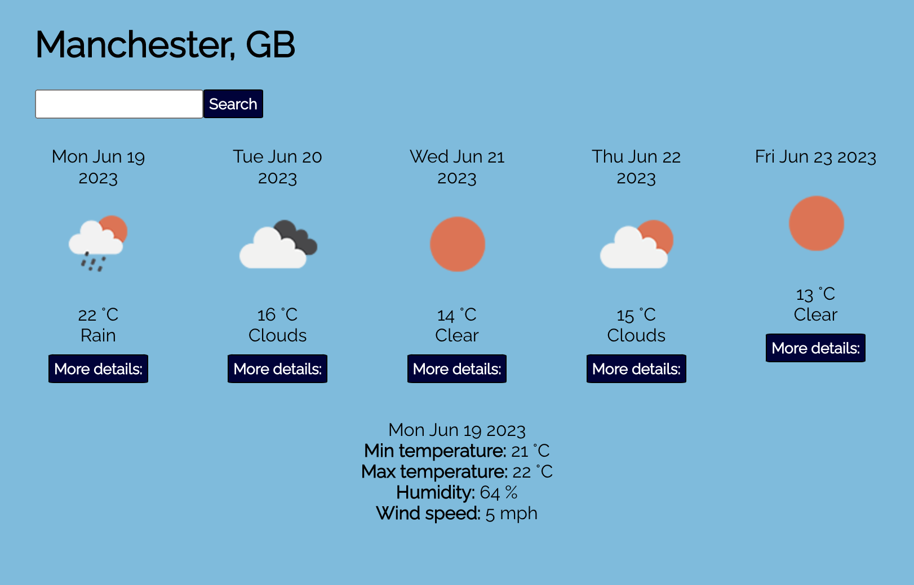

# Weather App

 

I built this app using React and JavaScript as a project for Command Shift bootcamp. It was created using the npx script `create-react-app`. I wrote the tests using Jest and React Testing Library.

Features:
- Users can search for a forecast by city.
- A more detailed summary is displayed when selected by the user.
- An error message is displayed on screen if an invalid city name is entered.

## Getting started

- Create a fork of this repo.
- Copy the fork's git address and clone to your machine using `git clone`. 
- Use `npm install` to download the dependencies.
- Use `npm test` to run the tests.
- Use `npm start` to run the app in your browser.

## How to use

- Enter the name of a city and click the "Search" button. The app will display a five day forecast for that city.
- To display a more detailed summary for a specific day, click the "More details" button.

